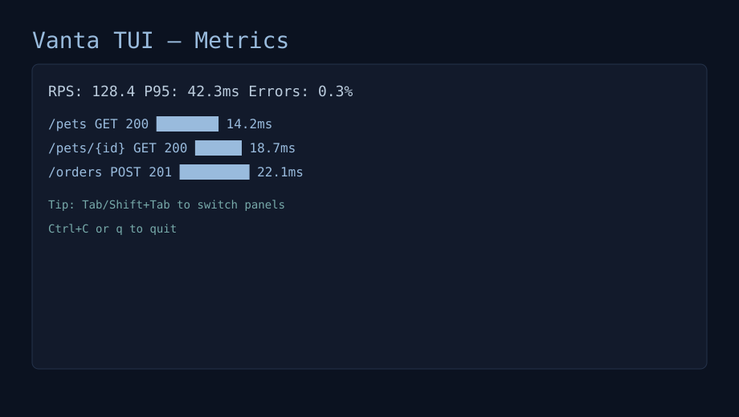
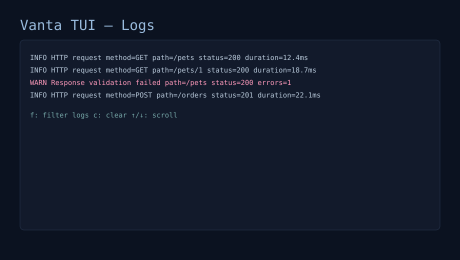

# Vanta — High‑Performance OpenAPI Mock Server

Vanta is a fast, developer‑friendly CLI and server for generating realistic mock APIs directly from OpenAPI 3.x specifications. It goes beyond static examples with intelligent data generation, chaos engineering, request/response validation, traffic recording & replay, plugin‑based middleware, metrics, hot reload, and a terminal UI for live operations.

Note: Some code examples use the legacy name “mocker”; the canonical CLI is “vanta”.

## Features

- Mock from OpenAPI: Parse OpenAPI and auto‑register routes, generating realistic JSON.
- Smart data generation: Deterministic by seed, supports formats, enums, objects/arrays.
- Middleware stack: Request ID, logging (zap), CORS, recovery, timeout, metrics.
- Chaos engineering: Inject latency and error scenarios by endpoint pattern & probability.
- Recording & replay: Capture, filter, list, show, export (WIP), and replay traffic.
- Plugins: Built‑in auth, rate limit, CORS, logging; extend with custom plugins.
- Validation: Validate requests/responses against OpenAPI; configurable strictness.
- TUI: Interactive terminal UI for metrics/logs/config and optional auto‑start.
- Hot reload & state: Watch config/spec, per‑session/request state with TTLs.
- Docker & Kubernetes: Container‑ready with example manifests.

## Quick Start

Start the mock server with the included Pet Store example:

```
vanta start --spec examples/petstore.yaml --port 8080
```

Test a few endpoints:

```
curl http://localhost:8080/pets
curl http://localhost:8080/pets/1
curl http://localhost:8080/__health
curl http://localhost:8080/__info
```

Responses follow your OpenAPI schema and prefer examples when provided. Default headers include `X-Mock-Response: true` and permissive CORS for convenience.

Or try the minimal quickstart example:

```
vanta start --spec examples/quickstart/openapi.yaml --config examples/quickstart/config.yaml
```

## Documentation

- Getting Started: docs/getting-started.md
- Configuration Reference: docs/configuration.md
- OpenAPI & Data Generation: docs/openapi-and-data-generation.md
- Middleware & Metrics: docs/middleware-and-metrics.md
- Chaos Guide: docs/chaos-guide.md
- Recording & Replay: docs/recording-and-replay.md
- Plugins Guide: docs/plugins-guide.md (Built-ins: docs/builtin-plugins.md)
- Validation Guide: docs/validation-guide.md
- TUI Guide: docs/tui-guide.md
- Hot Reload & State: docs/hot-reload-and-state.md
- Docker & Kubernetes: docs/docker-and-kubernetes.md

## Installation

### From Source
Prerequisites: Go 1.25+

```
git clone <your-repo-url> vanta && cd vanta
make build            # outputs bin/vanta
# or
go install ./cmd/mocker
```

### Docker

```
docker build -t vanta .
docker run --rm -p 8080:8080 \
  -v $PWD/examples:/app/examples \
  vanta start --config /app/examples/docker-config.yaml
```

### Script (multi‑platform)
An install script is provided in `scripts/install.sh` and can autodetect the repo from your local git remote. You can also set env vars explicitly.

One‑liner install (adjust owner/name if needed):
```
REPO_OWNER=<your-org> REPO_NAME=vanta \
  bash -c "$(curl -fsSL https://raw.githubusercontent.com/<your-org>/vanta/main/scripts/install.sh)"
```

Or run locally:
```
REPO_OWNER=<your-org> REPO_NAME=vanta scripts/install.sh --version vX.Y.Z
```

### Homebrew
If you maintain a tap (e.g., `<your-org>/tap`) with a `vanta` formula:
```
brew tap <your-org>/tap
brew install vanta
```
Without a tap, use the script or prebuilt binaries.

## Usage (CLI)

```
vanta start   --spec <openapi.yaml> [--config config.yaml] [--port 8080] [--host 0.0.0.0]
vanta tui     [--config config.yaml] [--spec openapi.yaml] [--readonly]
vanta chaos   <start|stop|status|list> [--config chaos.yaml] [...]
vanta record  <start|stop|list|show|delete|replay|export> [flags]
vanta version
```

Common examples:
- Start with spec and config:
  ```
  vanta start --spec examples/petstore.yaml --config examples/recording-config.yaml
  ```
- Launch the TUI:
  ```
  vanta tui --config examples/recording-config.yaml --spec examples/petstore.yaml
  ```
- Start chaos testing:
  ```
  vanta chaos start --config examples/chaos-config.yaml
  vanta chaos status --config examples/chaos-config.yaml
  ```
- Record and replay traffic:
  ```
  vanta record list --limit 10
  vanta record show <id> --format table
  vanta record replay --target http://localhost:9000 --since 1h --concurrency 3
  ```

## Configuration

Vanta reads configuration from `--config`. See `pkg/config/defaults.go` for defaults; examples live in `examples/`.

Minimal example:

```yaml
server:
  port: 8080
  host: "0.0.0.0"

mock:
  seed: 12345
  prefer_examples: true

middleware:
  request_id: true
  recovery:
    enabled: true
  cors:
    enabled: true
    allow_origins: ["*"]

metrics:
  enabled: true
  port: 9090
```

Key sections (high level):
- `server`: `port`, `host`, `read_timeout`, `write_timeout`, `max_conns_per_ip`, `concurrency`.
- `mock`: `seed`, `locale`, `max_depth`, `default_array_size`, `prefer_examples`.
- `middleware`: `request_id`, `cors.{...}`, `timeout.{...}`, `recovery.{...}`.
- `metrics`: `enabled`, `port`, `path`, `prometheus`.
- `chaos`: `enabled`, `scenarios[]` with `name`, `type` (latency|error), `endpoints[]`, `probability`, `parameters{}`.
- `recording`: `enabled`, `storage.{type,directory,format}`, `filters[]` (method|endpoint|status), `max_recordings`, `max_body_size`, `include_headers`, `exclude_headers`.
- `plugins`: list of `{ name, enabled, config }`.
- `validation`: `enabled`, `fail_on_invalid`, `validate_*`, `report_*`, `validation_timeout`.
- `hotreload`: `enabled`, `watch_config`, `watch_spec`, `debounce_delay`.
- `state`: `enabled`, storage/context/endpoints config.

## OpenAPI Mocking & Data Generation

- Routes auto‑register from your OpenAPI 3.x spec.
- JSON responses are generated from schemas (objects, arrays, enums, numeric/string constraints).
- Examples in the spec are returned when present; otherwise realistic data is generated.
- Deterministic runs: set `mock.seed` to get stable, repeatable outputs across runs.
- Path parameters are matched (`/pets/{petId}`) and used in routing.

## Middleware & Metrics

Middleware execution order:
1) Request ID → 2) Plugins → 3) CORS → 4) Logger → 5) Recovery → 6) Timeout → 7) Chaos → 8) Metrics → 9) Recording

- Logging uses zap (status, latency, sizes, user agent, request ID).
- Metrics collector tracks counters and latencies per method/path/status.
- CORS/timeout/recovery can be toggled in config.
- Recording and Chaos run as middlewares to capture full effects.

## Chaos Testing

Inject latency or errors on selected endpoints with a probability.

Example (`examples/chaos-config.yaml`):

```yaml
chaos:
  enabled: true
  scenarios:
    - name: "api_latency"
      type: "latency"
      endpoints: ["/api/*", "/v1/*"]
      probability: 0.1
      parameters:
        min_delay: "10ms"
        max_delay: "500ms"
    - name: "service_errors"
      type: "error"
      endpoints: ["/api/payments/*", "/api/orders/*"]
      probability: 0.05
      parameters:
        error_codes: [500, 502, 503]
        custom_body: '{"error":"Service temporarily unavailable"}'
```

CLI:
```
vanta chaos start --config examples/chaos-config.yaml
vanta chaos status --config examples/chaos-config.yaml
```

## Recording & Replay

Capture live traffic to file or memory and replay it later.

Config (`examples/recording-config.yaml`):

```yaml
recording:
  enabled: true
  storage:
    type: "file"
    directory: "./recordings"
    format: "jsonlines"
  max_recordings: 1000
  max_body_size: 1048576
  include_headers: ["content-type", "user-agent", "x-request-id"]
  exclude_headers: ["cookie", "set-cookie", "x-forwarded-for"]
  filters:
    - type: "method"   # include only
      values: ["GET", "POST"]
      negate: false
    - type: "endpoint" # include only
      values: ["/api/*", "/v1/*"]
      negate: false
    - type: "status"   # exclude redirects
      values: ["301", "302", "303", "307", "308"]
      negate: true
```

CLI:
```
vanta record list --limit 10
vanta record show <recording-id> --format table
vanta record replay --target http://localhost:9000 --since 1h --concurrency 3 --delay 100ms
```

Export formats (json/har/postman/curl) are scaffolded; some may be “not yet implemented”.

## Plugins

Enable built‑in plugins (auth, rate limit, CORS, logging) or build custom ones. Plugins integrate with FastHTTP via a manager and run with priorities.

Config:
```yaml
plugins:
  - name: auth
    enabled: true
    config:
      jwt_secret: "your-secret"
      auth_header: "Authorization"
      public_endpoints: ["/__health", "/__info"]

  - name: rate_limit
    enabled: true
    config:
      ip_requests_per_second: 100.0
      ip_burst: 200
```

See `docs/builtin-plugins.md` for full details and examples.

## Validation

Validate incoming requests and outgoing responses against your OpenAPI spec.

Config:
```yaml
validation:
  enabled: true
  fail_on_invalid: false
  validate_headers: true
  validate_query: true
  validate_path: true
  validate_body: true
  validate_status_codes: true
  report_format: ["json","html"]
  report_path: "./validation-reports"
  validation_timeout: 30s
```

- Set `fail_on_invalid: true` to reject invalid requests with 400/500.
- Warnings and errors are logged; reporting can be scheduled.

## TUI (Terminal UI)

Interactive dashboard for metrics, logs, and config editing with hot reload.

```
vanta tui --config examples/recording-config.yaml --spec examples/petstore.yaml
# add --readonly to disable editing
```

The TUI logs usage hints on launch (navigation, filters, save keys).

### Screenshots



## Hot Reload & State

- Hot reload: `hotreload.enabled: true` to watch config and spec and restart safely.
- State: `state.enabled: true` to maintain per‑session/request context (with TTLs) and per‑endpoint initial state.

## Docker & Kubernetes

### Docker
- Built using multi‑stage Dockerfile.
- Uses non‑root user, includes examples, exposes 8080.
- Healthcheck uses `start --config /app/examples/docker-config.yaml --health-check`.

### Kubernetes
See `examples/k8s/` and `examples/k8s/README.md`:
```
kubectl apply -f examples/k8s/
kubectl port-forward service/vanta 8080:80
curl http://localhost:8080/health
```

Includes service types, ingress (HTTP/HTTPS), liveness/readiness probes, Prometheus annotations, and scaling examples.

## End‑to‑End Tutorial

1) Start with spec and recording:
```
vanta start --spec examples/petstore.yaml --config examples/recording-config.yaml
```

2) Generate traffic:
```
curl http://localhost:8080/pets
curl http://localhost:8080/pets/1
```

3) Check health/info:
```
curl http://localhost:8080/__health
curl http://localhost:8080/__info
```

4) Inspect recordings:
```
vanta record list --limit 10
vanta record show <recording-id> --format table
```

5) Replay to a target:
```
vanta record replay --target http://localhost:9000 --since 30m --concurrency 3 --delay 100ms
```

6) Enable chaos and observe behavior:
```
vanta start --spec examples/petstore.yaml --config examples/chaos-config.yaml
# make requests; observe injected latency/errors
```

7) Optional: TUI for live monitoring:
```
vanta tui --config examples/recording-config.yaml --spec examples/petstore.yaml
```

## Troubleshooting

- Spec parsing issues: validate the OpenAPI file; ensure it’s reachable by the process.
- 404s: Confirm the path/method exists in your spec; check parameterized paths.
- CORS: Enable and configure `middleware.cors` for browser requests.
- Timeouts: Adjust `middleware.timeout.duration` and server read/write timeouts.
- Performance: Tune `server.concurrency`, `max_conns_per_ip`, and disable unneeded middleware.
- Recording not saving: Verify `recording.enabled`, directory permissions, body size limits, and filters.

## License

See `LICENSE`.
